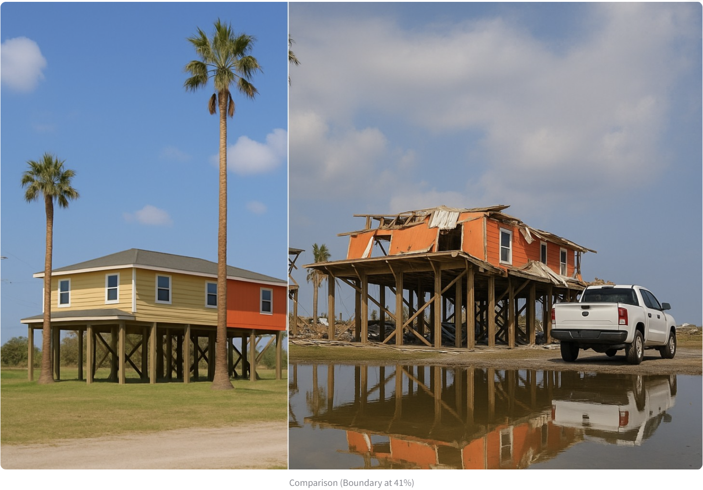

# Before/After Image Comparison App

A powerful and intuitive Streamlit application that creates interactive before/after image comparisons using a dynamic vertical slider. Perfect for visualizing changes over time, documenting progress, or showing transformations.



## 🌟 Features

- **Interactive Vertical Slider**: Smooth horizontal slider that controls the vertical boundary between images
- **Drag-and-Drop File Upload**: Easy interface for uploading both before and after images
- **Smart Image Resizing**: Automatic dimension matching for optimal comparison
- **Visual Boundary Indicator**: Clear white line showing the current division point
- **Side-by-Side Reference**: Expandable view of original images for comparison
- **Download Functionality**: Save your comparison as a PNG file
- **Demo Mode**: Built-in demonstration with sample images
- **Responsive Design**: Adapts to different screen sizes and devices

## 🚀 Installation

### Prerequisites

Make sure you have Python 3.7 or higher installed on your system.

### Install Required Dependencies

```bash
pip install streamlit pillow opencv-python numpy
```

### Alternative Installation with requirements.txt

Create a `requirements.txt` file:

```txt
streamlit>=1.28.0
pillow>=9.0.0
opencv-python>=4.5.0
numpy>=1.21.0
```

Then install:

```bash
pip install -r requirements.txt
```

## 🛠️ Usage

### Running the Application

1. Save the code as `before_after_app.py`
2. Open your terminal/command prompt
3. Navigate to the directory containing the file
4. Run the application:

```bash
streamlit run before_after_app.py
```

5. Your browser will automatically open to `http://localhost:8501`

### Using the App

1. **Upload Images**:
   - Click "Choose the 'before' image" and select your first image
   - Click "Choose the 'after' image" and select your second image
   - Supported formats: PNG, JPG, JPEG

2. **Compare Images**:
   - Use the slider to control the vertical boundary
   - Drag left to reveal more of the "before" image
   - Drag right to reveal more of the "after" image
   - The percentage indicator shows the current boundary position

3. **View Options**:
   - Enable "Resize images to match" to automatically scale images
   - Expand "View original images" to see the source files
   - Use the demo mode to understand how the app works

4. **Download**:
   - Click "Download Comparison Image" to save your current comparison
   - The file will be named with the current boundary percentage

## 🎯 Use Cases

This application is perfect for:

### 🏗️ Construction & Renovation
- Document building progress
- Show before/after renovations
- Track construction stages
- Demonstrate repair work

### 🌪️ Disaster Assessment
- Compare pre/post-disaster imagery
- Document recovery progress
- Track restoration efforts
- Assess damage extent

### 🏙️ Urban Development
- Show city growth over time
- Document infrastructure changes
- Compare land use changes
- Track development projects

### 🌱 Environmental Monitoring
- Showcase reforestation efforts
- Document climate change impacts
- Track seasonal changes
- Monitor ecological restoration

### 🏥 Medical Imaging
- Compare treatment progress
- Show surgical outcomes
- Document healing processes
- Analyze diagnostic changes

## 📁 Code Structure

```
before_after_app.py
├── create_before_after_comparison()  # Core comparison logic
│   ├── Image processing and alignment
│   ├── Boundary calculation
│   └── Visual indicator addition
├── main()                           # Main application flow
│   ├── UI setup and configuration
│   ├── File upload handling
│   ├── Image processing controls
│   └── Display and download logic
└── Sidebar instructions             # User guidance
```

## 🔧 Technical Details

### Image Processing
- Converts PIL images to NumPy arrays for efficient processing
- Automatically handles dimension matching between images
- Maintains aspect ratios when resizing
- Adds visual boundary indicator with anti-aliasing

### Performance Optimization
- Efficient NumPy array operations
- Minimal memory footprint
- Fast real-time updates with slider movement
- Responsive UI with lazy loading

### File Handling
- Supports multiple image formats (PNG, JPG, JPEG)
- Automatic type detection and conversion
- Memory-efficient image processing
- Secure file upload with validation

## 🎨 Customization Options

### Styling the Boundary Line
```python
# Change line color and thickness
line_thickness = 3
line_color = [255, 255, 255]  # RGB values
```

### Slider Configuration
```python
# Customize slider parameters
st.slider(
    "Drag to reveal before/after",
    min_value=0.0,
    max_value=1.0,
    value=0.5,      # Starting position
    step=0.01,      # Precision
    format="%.0%%"  # Display format
)
```

### Layout Adjustments
```python
# Modify column ratios
col1, col2 = st.columns([3, 7])  # 30/70 split
```

## 🐛 Troubleshooting

### Common Issues

**Image Not Displaying**
- Ensure image formats are supported (PNG, JPG, JPEG)
- Check file size (very large images may take time to process)
- Verify image files are not corrupted

**Slider Not Responsive**
- Refresh the page if the slider becomes unresponsive
- Check browser compatibility (works best with modern browsers)

**Download Issues**
- Ensure your browser allows downloads
- Check available disk space
- Try a different browser if download fails

### Performance Tips

- **For large images**: Enable image resizing for faster processing
- **For slow performance**: Reduce image dimensions before uploading
- **For memory issues**: Close other browser tabs and applications

## 📄 License

This project is open source and available under the MIT License.

## 🤝 Contributing

Contributions are welcome! Feel free to:
- Report bugs
- Suggest new features
- Submit pull requests
- Improve documentation

## 🙏 Acknowledgments

Built with:
- [Streamlit](https://streamlit.io/) - The web app framework
- [PIL/Pillow](https://pillow.readthedocs.io/) - Image processing library
- [OpenCV](https://opencv.org/) - Computer vision capabilities
- [NumPy](https://numpy.org/) - Numerical computations

## 📞 Support

For issues, questions, or suggestions:
- Open an issue on the project repository
- Check the troubleshooting section above
- Refer to the Streamlit documentation

---

> **Note**: This app requires a local Streamlit environment and cannot run directly in cloud environments without proper configuration. For cloud deployment, consider using Streamlit Cloud, Heroku, or similar platforms.
